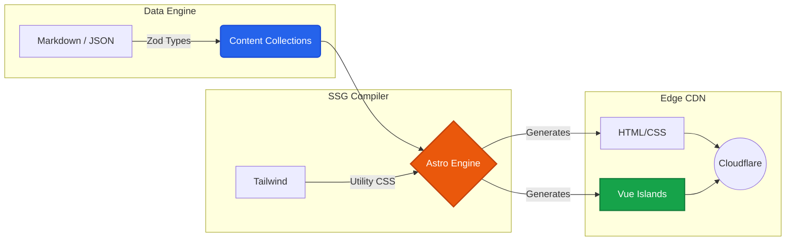

# Daniele Compagnoni — Engineering Portfolio
<div align="center">
  <!-- Replace this with a real screenshot collage once the site is built -->
  
  
  <br />
  
  [](#)
  [](#)
  [](#)
  [](#)
</div>
A high-performance, statically generated portfolio built to demonstrate architectural discipline, zero-bloat engineering, and seamless performance. 

This system relies on an **Islands Architecture**, delivering pure HTML/CSS by default and hydrating JavaScript strictly where client-side reactivity is required.

## ⚡ Tech Stack & Architecture

- **Core Engine (SSG):** [Astro](https://astro.build/)
- **Interactivity (Islands):** [Vue 3](https://vuejs.org/) (Composition API)
- **Styling:** [Tailwind CSS](https://tailwindcss.com/)
- **Data Integrity:** [Zod](https://zod.dev/) (Compile-time schema validation)
- **Deployment:** Cloudflare Pages (Edge network)

### System Architecture Data Flow



## 🏗️ System Capabilities

- **Zero-Bloat SSG:** Compiles strictly to static assets (`dist/`), achieving maximum Lighthouse performance scores.
- **Relational Data Mapping (No-DB):** Implements a compile-time bipartite mapping engine. Content collections (Markdown/JSON) are statically typed via Zod, dynamically cross-linking Projects, Skills, and Work Experience without a live relational database.
- **Quarantined Liquid Glass UI:** Selectively implements `backdrop-filter: blur()` and translucency to maintain accessibility and high-contrast text rendering without degrading mobile GPU scrolling performance.
- **Fully Accessible Theme Control:** System-level and user-toggled Light/Dark modes managed via inline script injection to prevent FOUC (Flash of Unstyled Content).

## 📂 Project Structure

This repository enforces a strict separation between uncompiled public assets, modular UI components, and the Zod-validated Markdown data engine.

```text
portfolio-daniele/
├── public/                 # Unprocessed assets (favicon, CV.pdf, robots.txt, default OG images)
├── src/                    
│   ├── assets/             # Astro-optimized imagery (compressed at build time)
│   ├── components/         # Modular UI building blocks
│   │   ├── global/         # Persistent layouts (Navbar, Footer, SEO head)
│   │   ├── ui/             # Reusable static components (Buttons, Badges, Cards)
│   │   └── vue/            # ⚡ Hydrated Islands (Client-side reactive logic like ProjectFilter.vue)
│   ├── content/            # The Data Engine (Markdown/JSON + Zod schemas)
│   │   ├── config.ts       # Master Zod validation schema
│   │   ├── experience/     # Chronological work history (.md)
│   │   ├── projects/       # Portfolio engineering work (.md)
│   │   ├── skills/         # Reference mappings for the reverse-lookup engine (.json/.yaml)
│   │   └── thoughts/       # Technical journal and articles (.md)
│   ├── layouts/            # Global structural scaffolding (Root, Markdown, Project layouts)
│   ├── pages/              # Astro file-system router (index, about, experience, etc.)
│   ├── styles/             # Global Tailwind directives and glassmorphism root variables
│   └── utils/              # Business logic (Date formatters, Compile-time relational mappers)
├── astro.config.mjs        # Core compiler configuration
├── tailwind.config.mjs     # Design system variables and typography constraints
└── tsconfig.json           # Strict TypeScript compiler rules
```

## 🚀 Local Development

To run this project locally, ensure you have Node.js (v18+) installed.

1. **Clone the repository:**
```bash
   git clone https://github.com/daniele-compagnoni/portfolio
   cd portfolio-architecture
```
2. **Install dependencies**:

```bash
   npm install
```
3. **Start the development server**:

```bash
   npm run dev
```
The site will be available at http://localhost:4321.

4. **Build for production**:

```bash
   npm run build
```
This command validates all Zod schemas, optimizes images, resolves relational mappings, and outputs static assets to the dist/ directory.
## ⚖️ License
The source code of this portfolio is licensed under the MIT License. 
However, all text content, project descriptions, resume details, 
and images are copyright © 2026 Daniele Compagnoni. All Rights Reserved.

---
## 👨‍💻 Author

**Daniele Compagnoni** 
- **Live Portfolio:** [Visit the Live Website]()
- **LinkedIn:** [Visit Daniele Compagnoni's Linkedin](https://www.linkedin.com/in/daniele-compagnoni-5b3a502a6/)
