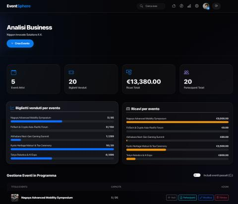
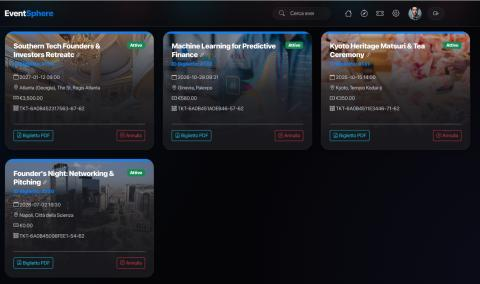
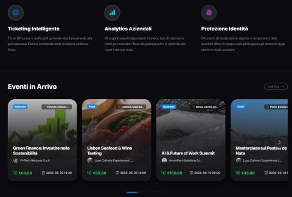
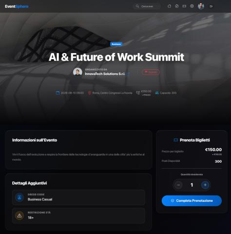
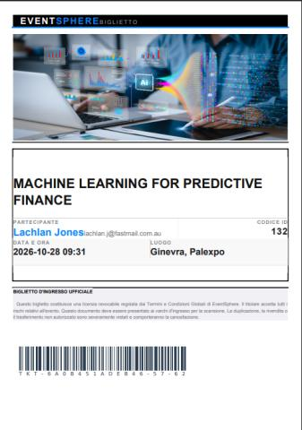

[📥 **Download Full Backend Report PDF**](/eventsphere-backend_report.pdf)

EventSphere is a full-stack web platform for end-to-end event management, built as the capstone project for the Web Technologies and Systems course at Sapienza University of Rome. The system supports three distinct actor types — Administrators, Organizers, and Customers — with a Role-Based Access Control (RBAC) model governing access at every layer of the stack.

## Key Technical Highlights

- **Custom MVC engine** with native PHP routing, PDO-based DAOs, and a BaseModel abstraction enforcing prepared statements across all database interactions.
- **PostgreSQL schema** with ACID-compliant booking transactions, using atomic `beginTransaction()` / `rollBack()` / `commit()` cycles to prevent race conditions and double-booking.
- **JSONB columns** for dynamic event metadata alongside strict relational integrity constraints.
- **PDF ticket generation** via a three-stage pipeline: PostgreSQL → XML serialization → XSLT layout transformation → TCPDF rendering.
- **Secure image upload module** validating magic bytes (not file extensions), reassigning cryptographic UUIDs, and storing assets in execution-restricted directories.
- **Islands Architecture frontend**: SSR via PHP template views for core pages, with Vue.js micro-frontends scoped to high-state contexts (organizer/customer dashboards) and AJAX/JSON pipelines served by a dedicated ApiController.
- **Glassmorphism design system** implemented in pure CSS3 — zero frontend framework dependencies outside the constrained Vue.js island.

The project was developed in a two-person team targeting top marks, with full deployment support via both Docker Compose and bare-metal PHP/PostgreSQL environments.

---

## UI Showcase

